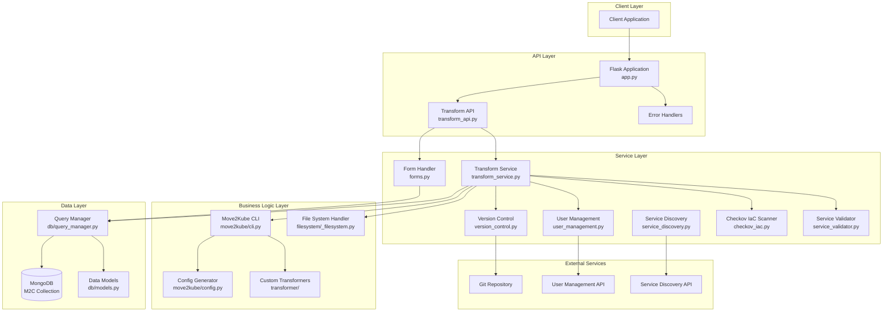
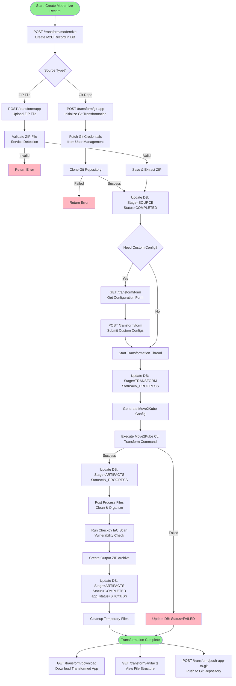
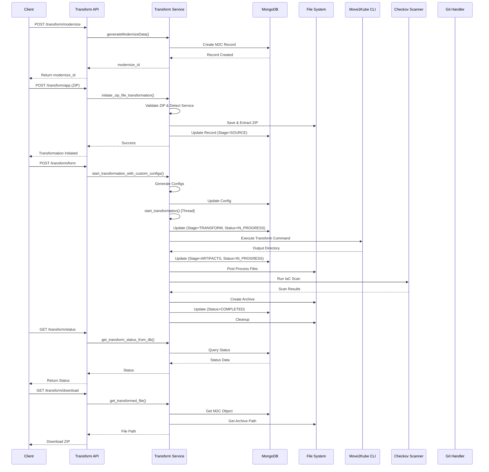
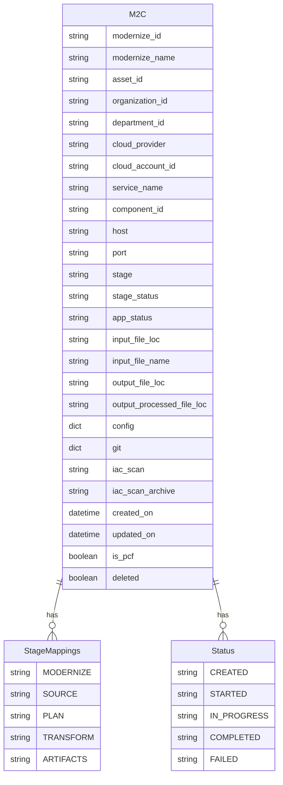
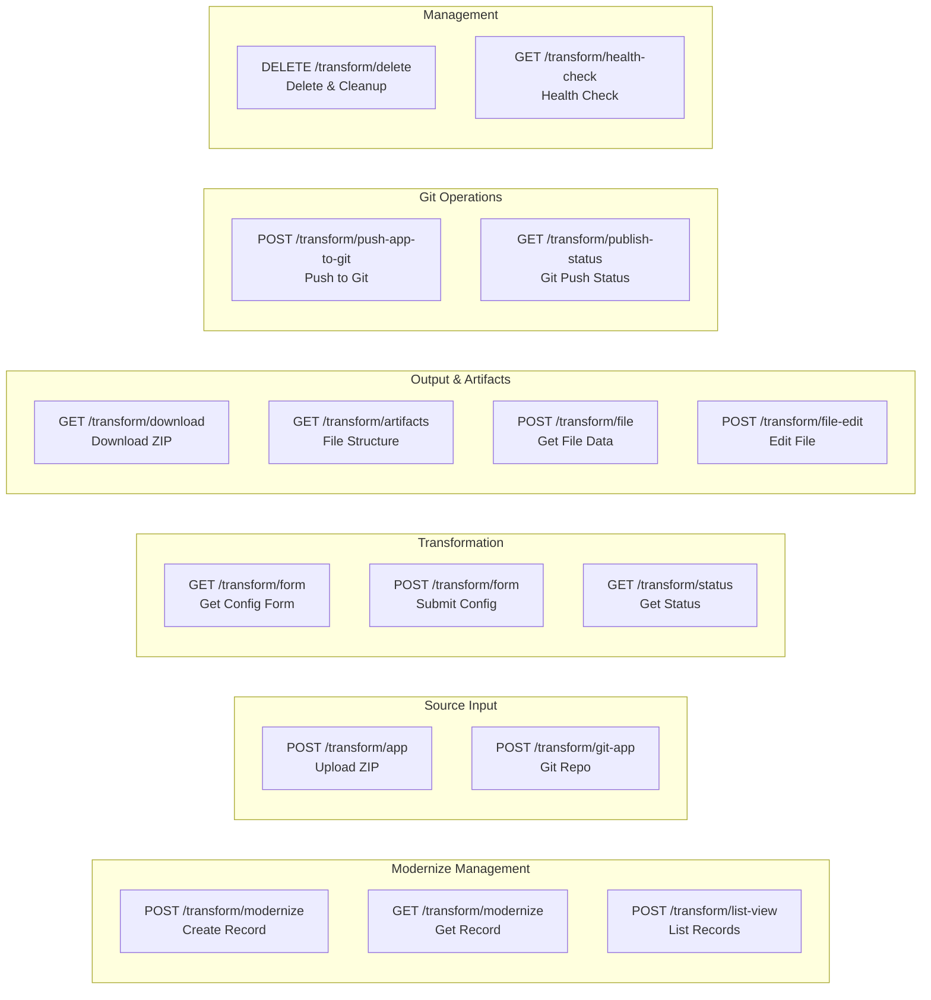

# Transform2Container Architecture & Flow Diagrams

## System Architecture

## Application Transformation Flow

## Detailed Component Flow

## Database Schema

## API Endpoints Overview

## Technology Stack

- **Framework**: Flask + Flask-RESTX
- **Database**: MongoDB (via MongoEngine)
- **Transformation Engine**: Move2Kube CLI
- **IaC Scanning**: Checkov
- **Version Control**: Git (via GitHub handler)
- **Language**: Python 3.11
- **Container**: Docker (Ubuntu 22.04)

## Key Features

1. **Multi-Source Input**: Supports ZIP file uploads and Git repository cloning
2. **Service Detection**: Automatically detects service type from ZIP contents
3. **Custom Configuration**: Form-based configuration for transformation parameters
4. **Asynchronous Processing**: Thread-based transformation execution
5. **IaC Security Scanning**: Integrated Checkov for infrastructure security
6. **Git Integration**: Push transformed artifacts to Git repositories
7. **File Management**: View, edit, and download transformed artifacts
8. **Status Tracking**: Real-time status updates through database stages

